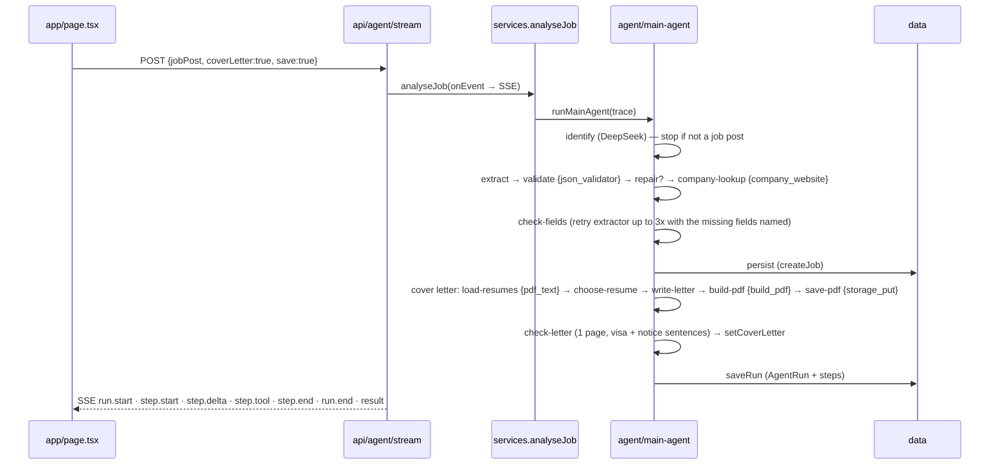

# Architecture

Current as of 2026-10-01 (after the Jev removal and the workflow inspector).

## Layers

Everything lives under `src/`, and imports use the `@/` alias. A layer may import only from the
layers listed beside it (`eslint.config.mjs`, rule `import/no-restricted-paths`):

| Layer | May import | What lives here |
| --- | --- | --- |
| `domain` | — | Types and constants: `Job`, `JOB_STATUSES`, `CONTRACT_TYPES`, `AgentRun`, `RunStep`, `ToolCall`, `DashboardMetrics`. Zod schemas in `domain/schemas` (import explicitly). No IO. |
| `infra` | domain | Adapters: `db/` (D1 over HTTP, local `node:sqlite`), `storage/` (R2, local folder), `llm/deepseek.ts`, `search/`, `pdf/` (read CVs, render the letter), `env.ts`. |
| `data` | domain, infra | Repositories and read models: `job-repository`, `run-repository`, `file-repository`, `resume-repository`, `candidate-profile`, `metrics`, `pipeline`. |
| `agent` | domain, infra, data | `core/` (`trace.ts` RunTrace, `tool.ts` callTool, `create-trace.ts`, `model-detail.ts`), `tools/`, `prompts/`, `steps/`, `main-agent.ts`. |
| `services` | + agent | One function per use case, shared by API and CLI: `analyseJob` (+ `analyseRequestSchema`, `serialiseAnalysis`), `getHealth`. |
| `server` | domain, services | `http.ts`: `readJsonBody`, `readQuery`, `failure`. |
| `app` | domain, data, services, server, components | Next routes (`api/`) and two pages: `/` (analyse) and `/dashboard`. |
| `components` | domain | Client React. Types from domain only, never infra or data. |
| `cli` | domain, infra, data, agent, services | Terminal output (`render.ts` EventPrinter), args, trace files. |

`scripts/*.ts` are thin entry points for `npm run`. They must not import `app`, `components` or
`server`. Tests mirror the layers under `tests/<layer>/`. `tests/helpers.ts` gives an in-memory
SQLite database with every migration applied.

## A run, end to end

Steps and their `sAgent`: `identify`, `check-fields`, `persist`, `check-letter` (main);
`extract`, `validate`, `repair`, `company-lookup` (extractor); `load-resumes`, `choose-resume`,
`write-letter`, `build-pdf`, `save-pdf` (cover-letter). A step that was deliberately not run is
recorded with `trace.skip(...)` and status `skipped`. `AgentName` in `domain/run.ts` is
`"main" | "extractor" | "cover-letter"`.

## The trace contract

`RunTrace.step(name, label, fn, { sAgent, iAttempt })` records one step. Inside it:

- `step.detail({...})` merges facts into `oDetail`. That is what the UI, the CLI and the stored run show.
- `step.addUsage(usage)` counts tokens. `step.delta(text)` streams model output.
  `step.setStatus("failed")` marks a non-throwing failure.
- A throw is recorded as `failed`, with `oDetail.error`, and rethrown.
- `callTool(step, tool, input)` records a `ToolCall` (`tool`, `durationMs`, `ok`, `summary`,
  `detail.input`; the input is redacted, so long strings and bytes are cut down).

Keys in `oDetail` that mean something to the UI:

| Key | Meaning |
| --- | --- |
| `raw` | The model's answer exactly as sent (≤ 4000 chars). The inspector parses it as JSON. |
| `reasoning`, `reasoningChars` | DeepSeek's `reasoning_content` (capped at 6000 chars by `modelDetail`). |
| `model`, `apiMs`, `finishReason` | From `modelDetail(result)`. |
| `instructions` | The prompt the decision was judged against (step 1 only). |
| `sReason`, `bIsJobPost`, `sLooksLike` | Step 1's verdict. |
| `reason`, `issues`, `missing`, `thin`, `chose`, `rejected`, `error` | Feed the inspector's "Why" (`stepWhy` in `components/agent-workflow.tsx`). |

The CLI (`cli/render.ts`) skips `raw`, `reasoning` and `instructions` in its default output.

## Web UI

- **`/` analyse page** (`app/page.tsx`): grid areas `input | flow` over `results | flow`, one
  column under 900px. The left side has the advert, notices, the extracted job and the letter.
  The right side has `AgentWorkflow` (`components/agent-workflow.tsx`), a sticky timeline. Click a
  step to open its inspector: Why → How the model reasoned → Model answer (JSON) → Tools used
  (each expandable to its input) → What it was told to check → All step data, each with Copy.
- **`/dashboard`**: tiles, a pipeline Sankey, and the Applications table. Rows are sorted
  newest-first by `dtDateTime` on the client (the API already orders by
  `datetime(dtDateTime) DESC`). "Added" shows the local date and time. `StatusFilter`
  (`components/charts.tsx`) sits left of "x tracked" and shows counts per status. Row status
  changes go through `PUT /api/jobs/:id/status`.
- **`components/dashboard-data.ts`** is a module-scoped cache that survives client-side
  navigation. Refresh, a status change, and a run that saved a job all call `clearCache()`.

## Data

Tables: `Job`, `JobStatusHistory`, `JobFile`, `AgentRun`, `AgentRunStep`. Field prefixes: `s`
string, `b` boolean, `i` integer, `f` float, `dt` ISO datetime, `o` object, `a` array.
`Job.sDeepestStatus` is the furthest stage reached. The funnel reads history, so a job rejected
after a final interview still counts as an interview. Soft delete is `bDelete`. Rows from failed
runs have `bError = 1` and are hidden from lists unless `includeErrors`.

The metrics (`data/metrics.ts`) are one batch of SQL statements read back **by array index**
(`results[0]` … `results[12]`). Removing or adding a query shifts every index after it.

Storage keys: CVs under `resume/`, letters at `Company-Name/Company-Name_Role.pdf`
(`coverLetterKey`).

## API

`POST /api/agent` and `POST /api/agent/stream` (SSE) · `GET|POST /api/jobs` · `GET|PATCH|DELETE /api/jobs/:id` ·
`PUT /api/jobs/:id/status` · `GET /api/jobs/:id/cover-letter` · `GET /api/metrics?windowDays=` ·
`GET /api/runs` · `GET /api/runs/:id` (a stored run with every step) · `GET|POST /api/files` ·
`GET|DELETE /api/files/:id` · `GET /api/health` (which database and file drivers, which model).

## Configuration

`.env` (template in `.env.example`): `DEEPSEEK_API_KEY`, `DEEPSEEK_BASE_URL`, `DEEPSEEK_MODEL`;
`JOB_DB` (`d1` | `local`) with `CLOUDFLARE_ACCOUNT_ID`, `CLOUDFLARE_D1_DATABASE_ID`,
`CLOUDFLARE_API_TOKEN`, `LOCAL_DB_PATH`; `FILE_STORAGE` (`r2` | `local`) with `R2_BUCKET`,
`R2_ACCESS_KEY_ID`, `R2_SECRET_ACCESS_KEY`, `R2_ACCOUNT_ID`, `LOCAL_FILES_PATH`. Real environment
variables override `.env`, which is how the isolated test server works. With no DeepSeek key the
agent runs in demo mode (a local parser, same steps).

## The public demo (added 2026-10-05)

Same code, `DEMO_MODE=1`, on Cloudflare Workers via `@opennextjs/cloudflare`. Full write-up with a
diagram: `docs/ARCHITECTURE.md` → "The public demo". The essentials:

- Drivers: `JOB_DB=d1-binding` and `FILE_STORAGE=r2-binding` (`infra/db/d1-binding.ts`,
  `infra/storage/r2-binding.ts`, bindings from `infra/cloudflare.ts`). No API tokens in the Worker. No
  signed URLs, so the cover-letter route streams the PDF.
- Visitors: `server/demo.ts` (cookie `jp_demo` + salted SHA-256 of the IP, salt = secret `DEMO_SECRET`).
  Limits in `services/demo.ts`: 1 run per visitor ever, 3 per IP per UTC day, `DEMO_DAILY_RUN_CAP`
  (40) per day. Table `DemoRun` (migration 0006); the nightly reset leaves it alone.
- `prepareAnalysis` takes the run before the SSE stream opens (so a refusal is a JSON 429 the page
  toasts), forces `save`, `coverLetter`, no website lookup. `analyseJob` gives the run back if it fails.
- Allowed in the demo: one analysis, letter download, status changes. Refused (403 `demo-read-only`):
  POST /api/jobs, PATCH fields, DELETE jobs/files/runs, POST /api/files.
- The candidate profile is read from storage first (`profile/candidate.json`, `profile/highlights.md`),
  then `data/`. CV text has an optional cache at `resume-text/<key>.json`, used when its `size` matches,
  because a PDF parse would blow the free plan's 10 ms CPU per request.
- Demo content lives in `demo/` (profile, `resume.json` → two PDF variants, ten adverts + `plan.json`).
  `npm run demo:data` turns it into `demo/seed.sql` (dates relative to `'now'`) and `demo/bucket/`.
