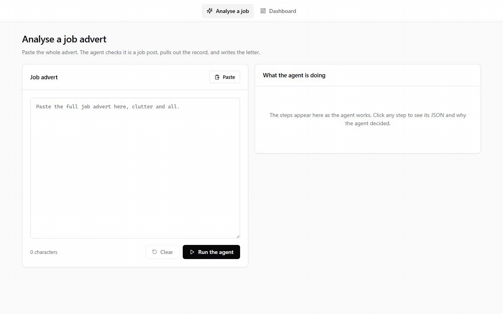
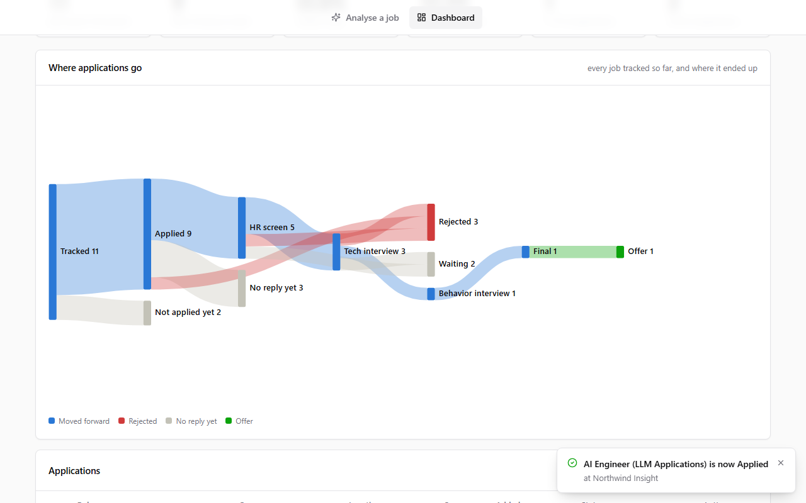

# JobPilot

An AI agent for job applications. Paste a job advert and it checks that the text really is an advert,
extracts a structured record, picks the CV that fits best and writes a one-page cover letter. Every step
is traced, streamed live and stored, so you can see what the model was asked, what it answered and why.
A dashboard follows each application through the hiring funnel.

<!-- live-demo: filled in by npm run demo:deploy -->
**[Live demo](https://jobpilot-demo.fionasundev.workers.dev)**: a fictional candidate and fictional companies, with one live AI run per visitor.
<!-- /live-demo -->



## Try it in three clicks

1. Open the [live demo](https://jobpilot-demo.fionasundev.workers.dev) and click **Use the example advert**.
2. Click **Run the agent** and watch the steps arrive. Click any step to see why the agent decided what it
   did, the JSON the model sent back and each tool it called.
3. Click **Download the PDF**, then **Track it on the dashboard** and change the application's status. The
   pipeline graph moves with it.

Each visitor gets one live AI analysis; a second one is refused with a demo message. Status changes are
unlimited. Everything resets to the fictional data every night.

## What it demonstrates

- **An agent you can audit.** A main agent supervises three steps: is this a job advert, extract the
  record, write the letter. Each step records its model, tokens, reasoning, raw answer and tool calls. The
  page streams them over server-sent events, and every run is archived so it can be replayed.
- **Model output that is checked, not trusted.** Zod schemas validate every JSON answer, a failed answer
  gets one repair pass with the exact errors, and missing required fields send the extractor back with the
  field named. The facts a letter must get right (visa, notice period) are templated, never generated.
- **A layered architecture, enforced.** `domain → infra → data → agent → services → server / app / cli`.
  ESLint fails the build on a crossing. See [docs/ARCHITECTURE.md](docs/ARCHITECTURE.md).
- **Serverless on free tiers.** Next.js 15 on Cloudflare Workers through OpenNext, with D1 for records
  and R2 for files. The deploy builds in a clean room and scans the output, so no secret can ride along.
- **Tested.** 69 Vitest tests run against an in-memory database, and CI runs them on every push.

**Stack:** TypeScript, Next.js 15, React 19, Cloudflare Workers, D1 and R2, DeepSeek (OpenAI-compatible
API), Zod, pdf-lib, Vitest, GitHub Actions.



---

## For developers

### Layout

Everything under `src/` sits in a layer, and a layer only imports from the layers below it. The rule is
enforced by ESLint; the full picture, with diagrams and a "where does a change go" table, is in
[docs/ARCHITECTURE.md](docs/ARCHITECTURE.md).

```text
src/domain/      what a job, a run and a dashboard ARE: types, constants, zod schemas. No IO.
src/infra/       adapters: db/ (D1 over HTTP or a Worker binding, SQLite), storage/ (R2 or a binding, local), llm/, search/, pdf/
src/data/        repositories and read models: jobs, runs, files, resumes, candidate profile, demo runs, metrics, pipeline
src/agent/       the agent: core/ (trace, tool contract), tools/, prompts/, steps/ (identify, extract, letter), main-agent
src/services/    one function per use case, shared by the API and the CLI: analyseJob, getHealth, demo
src/server/      HTTP glue for route handlers: parse and validate, map errors, demo visitors
src/app/         Next.js: api/ route handlers and the two pages
src/components/  React components (client code, domain types only)
src/cli/         terminal presentation: arguments, the live step printer, trace files
scripts/         the npm-run entry points, thin; scripts/demo/ builds and ships the public demo
demo/            the demo's fictional inputs, its seed SQL and its bucket files
db/migrations    SQL schema (applied by npm run db:migrate or wrangler)
tests/           Vitest suite by layer, runs against an in-memory database
```

### Setup

```bash
npm install
cp .env.example .env
```

**The agent.** Put a DeepSeek key in `.env`, then confirm the model id is one your key can call with
`npm run check:model`. With no key the agent still runs: a deterministic local parser, same steps, same
trace, no network.

**Cloudflare D1 (free plan).** Create an API token at <https://dash.cloudflare.com/profile/api-tokens> with
**Account → D1 → Edit**, put it in `.env` as `CLOUDFLARE_API_TOKEN`, then run `npm run d1:setup` (finds your
account, creates the `jobpilot` database, fills `.env` and `wrangler.real.toml`) and `npm run db:migrate`.
To work offline, set `JOB_DB=local` and the same SQL runs against `data/jobpilot.db` through `node:sqlite`.

**Cloudflare R2 (free plan).** R2 needs its own S3 key pair: dashboard → R2 → API → Manage API tokens →
Object Read & Write. Put the pair in `.env` as `R2_ACCESS_KEY_ID` and `R2_SECRET_ACCESS_KEY`, then run
`npm run r2:setup`. Set `FILE_STORAGE=local` to keep files in `data/files` instead.

### Commands

```bash
npm run dev                  # the web app on :3000: analyse page / and dashboard /dashboard
npm run agent:clip           # the whole flow on the advert in your clipboard
npm run agent:dry            # the same, nothing saved
npm run extract:clip         # the extractor alone, no database
npm run cv:list              # the CVs the agent can see
npm run metrics              # the dashboard numbers in the terminal
npm run db:migrate           # apply db/migrations
npx tsc --noEmit && npx eslint . && npx vitest run   # the checks CI runs
```

PowerShell swallows a bare `--`, so quote it (`npm run x "--" "--flag"`) or call
`node --import tsx scripts/<name>.ts …` directly.

### API

| Method | Route | What it does |
| --- | --- | --- |
| POST | `/api/agent` | Analyse an advert; returns the result and the full step trace |
| POST | `/api/agent/stream` | The same as server-sent events: `run.start`, `step.start`, `step.delta`, `step.tool`, `step.end`, `run.end`, `result` |
| GET | `/api/jobs` | List applications. Filters: `sStatus`, `sSource`, `sCompany`, `sContractType`, `windowDays`, `search`, `activeOnly`, `limit`, `offset` |
| POST | `/api/jobs` | Track a job by hand |
| GET, PATCH, DELETE | `/api/jobs/:id` | One application; change its fields or status; remove it |
| PUT | `/api/jobs/:id/status` | Change the status, in either direction |
| GET | `/api/jobs/:id/cover-letter` | The letter PDF (a signed R2 link, or streamed) |
| GET | `/api/metrics` | Dashboard numbers. `?windowDays=90` limits them to jobs tracked in that period |
| GET | `/api/runs`, `/api/runs/:id` | Run history, and one run with every step |
| GET, POST, DELETE | `/api/files`, `/api/files/:id` | The file index and its objects |
| GET | `/api/demo`, `/api/demo/resume` | Demo mode only: this visitor's status, and the fictional CV |
| GET | `/api/health` | Database and storage reachable, which drivers, which model |

Request body for both analyse routes: `{ "jobPost": "the full advert text", "save": true, "coverLetter": true }`.

### How the agent works

```text
[1] (main)         Is this a job advertisement?      stops here if it is not
[2] (extractor)    Read the advert, return JSON
[3] (extractor)    Check the JSON against the schema  {json_validator}
[4] (extractor)    Repair                             skipped when the first answer validates
[5] (extractor)    Find the company's own website     {company_website}
[6] (main)         Check the extracted record         required fields must not be empty
[7] (main)         Save the application
[8] (cover-letter) Read the resumes in storage        {pdf_text} per CV
[9] (cover-letter) Pick the resume that fits          with a comparative reason
[10](cover-letter) Write the letter                   two sections; the third is templated
[11](cover-letter) Render a one-page PDF              {build_pdf}
[12](cover-letter) Save to storage                    {storage_put}
[13](main)         Check the letter before it goes out
```

Step 1 is a model decision, not a keyword list: a "no" stops the run with the model's reason. Step 6
requires `sCompany`, `sJobTitle`, `sJobSummary`, `sJobRequirement`, `sContractType` and `sSource`; an
empty one sends the advert back to the extractor naming that field, up to three attempts.

### Cover letters

The letter step reads every CV under `resume/` in the bucket, picks the one that fits the advert, and
writes three sections: an introduction, "Why I Am a Good Fit" (each sentence names a requirement and the
evidence for it), and "Additional Information", which is assembled from the candidate profile and never
written by the model. The profile is `profile/candidate.json` and `profile/highlights.md` in storage when
present, otherwise `data/candidate.json` and `data/highlights.md` on your machine. The PDF is stored as
`Company-Name/Company-Name_Role.pdf`, and that key is what `Job.sCoverLetterPath` holds.

### Dashboard numbers

The funnel uses each application's furthest stage (`sDeepestStatus`), so a job rejected after a final
interview still counts as having reached it. The date range limits the table, the tiles and the graph to
jobs tracked in that period, so all three always count the same rows.

### The public demo

The live demo is this code with `DEMO_MODE=1` on Cloudflare Workers, bound only to its own database
(`jobpilot-demo`) and bucket (`jobpilot-demo-files`). Your own data is never involved.

```bash
npm run demo:local     # the demo on http://localhost:3200, from the committed seed
npm run demo:data      # rebuild demo/seed.sql and demo/bucket/ with real agent runs on the fictional adverts
npm run demo:reset     # load the seed and files into the demo D1 and R2 (also runs nightly in GitHub Actions)
npm run demo:deploy    # manual deploy: clean-room build, secret scan, DeepSeek key as a Worker secret
```

**Deploys are automatic.** Cloudflare Workers Builds is connected to this repository: every push to
`master` builds with `npx opennextjs-cloudflare build` and deploys with `npx wrangler deploy` into the
Worker `jobpilot-demo` (the name must match `wrangler.jsonc`). Builds clone from GitHub, where there is no
`.env`, so nothing secret can reach the bundle. The Worker's runtime secrets, `DEEPSEEK_API_KEY` and
`DEMO_SECRET`, are set once in the dashboard (Settings → Variables and Secrets, Production) and survive
every deploy. `npm run demo:deploy` is the manual route; its token needs **Account → Workers Scripts →
Edit** (`CLOUDFLARE_DEPLOY_TOKEN` in `.env`). The nightly reset needs `CLOUDFLARE_ACCOUNT_ID` and
`CLOUDFLARE_API_TOKEN` as repository secrets. Never run `opennextjs-cloudflare build` or `wrangler dev` in the project folder: both
read `.env`, and the build embeds what it reads.
