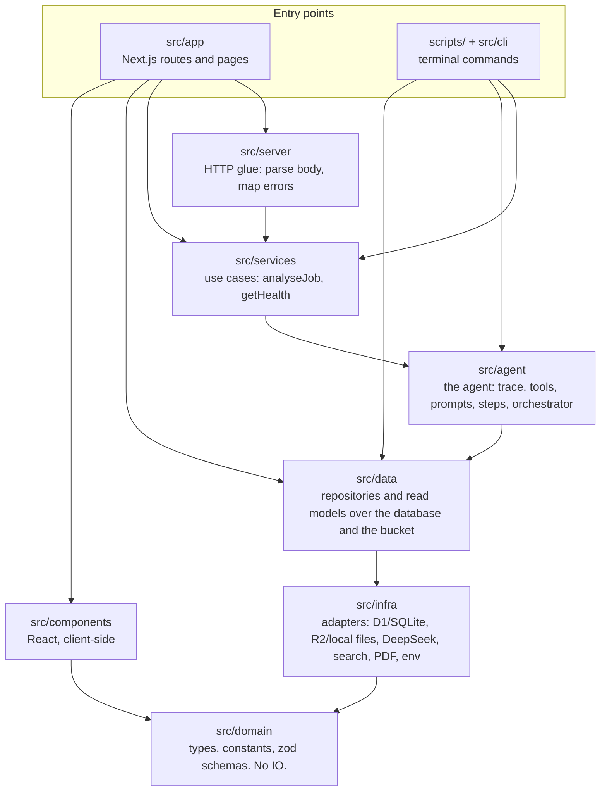
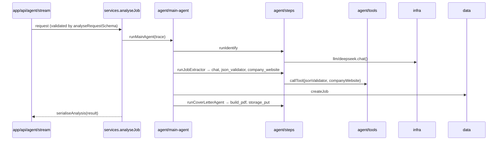
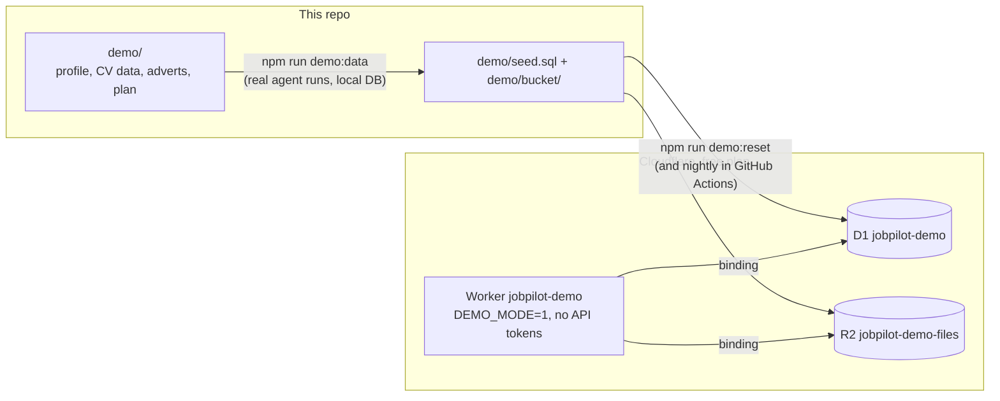

# Architecture

Everything under `src/` sits in one of six layers. A layer may import from the layers below it and never
from the ones above. The rule is enforced by ESLint (`import/no-restricted-paths` in `eslint.config.mjs`),
so `npm run lint` fails on a crossing, not a code review.

## The layers

| Layer | Folder | What lives here | May import |
| --- | --- | --- | --- |
| **domain** | `src/domain` | What a job, a run and a dashboard *are*: types, constants (`JOB_STATUSES`, `CONTRACT_TYPES`), and the zod schemas that validate a record. Nothing does IO. | nothing |
| **infra** | `src/infra` | Talking to the outside world, each behind a small interface: `db/` (D1 over HTTP, D1 through a Worker binding, local SQLite), `storage/` (R2 over S3, R2 through a Worker binding, local folder), `cloudflare.ts` (the Worker's bindings), `llm/` (DeepSeek chat), `search/` (web search providers), `pdf/` (read a CV, render a letter), `env.ts`. | domain |
| **data** | `src/data` | How records are stored and read: `job-repository`, `run-repository`, `file-repository`, `resume-repository` (with a pre-extracted text cache), `candidate-profile` (storage first, then `data/`), `demo-run-repository` (the demo's run limits), `window` (the dashboard date range), and the read models `metrics` and `pipeline`. | domain, infra |
| **agent** | `src/agent` | What the agent does. `core/` (the run trace, the tool contract, the trace factory), `tools/` (thin wrappers the steps call: `json_validator`, `company_website`, `build_pdf`, …), `prompts/` (what the models are asked), `steps/` (identify, extract, cover letter), `main-agent.ts` (the orchestrator). | domain, infra, data |
| **services** | `src/services` | One function per use case, shared by the API and the CLI so they cannot drift: `analyseJob` (with `prepareAnalysis`), `getHealth`, and `demo` (demo mode, its limits and messages). Request schemas live with the service that owns them. | domain, infra, data, agent |
| **server** | `src/server` | HTTP glue for route handlers: `http.ts` reads a JSON body or query against a schema and turns an error into a status; `demo.ts` identifies a demo visitor (cookie plus salted IP hash) and builds the demo refusals. | domain, services |
| **app** | `src/app` | Next.js: `api/` route handlers (thin controllers) and the two pages. | domain, data, services, server, components |
| **components** | `src/components` | React components. Client code, so it sees domain types only. | domain |
| **cli** | `src/cli` | Terminal presentation: argument parsing, the live step printer, the trace file writer. `scripts/*.ts` are the thin entry points `npm run` calls. | domain, infra, data, agent, services |

Outside `src/`: `scripts/` (entry points; `scripts/demo/` builds and ships the public demo), `tests/` (mirrors the layers), `db/migrations/` (schema), `demo/` (the demo's fictional inputs, seed and files), `data/` (local files, gitignored), `docs/`.

## Where does a change go?

| I want to… | Touch |
| --- | --- |
| Add a column to Job | `db/migrations/000N_*.sql`, `src/domain/job.ts`, `src/data/job-repository.ts` (columns + `rowToJob`) |
| Add an agent step | `src/agent/steps/<step>.ts`, wire it in `src/agent/main-agent.ts`, give it a name in `AgentName` (`src/domain/run.ts`) |
| Add a tool a step can call | `src/agent/tools/<tool>.ts` implementing `Tool`, export it from `src/agent/tools/index.ts`. The real work goes in `src/infra` or `src/data`; the tool only wraps it |
| Add a model or provider | `src/infra/llm/` or `src/infra/search/`. Nothing above infra should know a vendor's wire format |
| Add an API route | `src/app/api/.../route.ts` using `readJsonBody`/`readQuery`/`failure` from `src/server/http.ts`. Anything the CLI also needs goes in `src/services` first |
| Add a CLI command | `scripts/<name>.ts` + an npm script. Output through `src/cli/render.ts`; logic through `src/services` |
| Show something new on the dashboard | `src/data/metrics.ts` (query) → `src/domain/metrics.ts` (type) → `src/components` / `src/app/dashboard` |

## How a run flows through the layers

Every step is recorded by `RunTrace` (`src/agent/core/trace.ts`) and every tool call goes through
`callTool`, so the same trace feeds the SSE stream, the terminal printer and the archived run.

## The public demo

The same code runs as a public demo on Cloudflare Workers (free plan), with `DEMO_MODE=1` and only
fictional data. Your real setup is untouched: it keeps its own database and bucket, named in
`wrangler.real.toml`, and the demo Worker in `wrangler.jsonc` is bound only to `jobpilot-demo` and
`jobpilot-demo-files`.

What a visitor can do: one live AI analysis (one per visitor cookie, three per IP per day, a daily
cap for everyone), download the letter it wrote, and change any application's status. Everything
else that writes (deleting, uploading, editing fields) is refused with a "demo environment" message.

| Concern | Where |
| --- | --- |
| Is this the demo, how many runs, the messages | `src/services/demo.ts` |
| Who the visitor is | `src/server/demo.ts` (random id in an HttpOnly cookie, salted SHA-256 of the IP) |
| Taking and giving back a run | `prepareAnalysis` / `analyseJob` in `src/services/analyse-job.ts`, table `DemoRun` (`db/migrations/0006`) |
| The page's intro, example advert, toast | `src/components/demo.tsx`, `src/components/demo-example.ts`, `src/app/page.tsx` |
| The fictional candidate | `demo/profile/`, read by the Worker from `profile/` in its bucket |
| Building, resetting, running locally, deploying | `scripts/demo/build-data.ts`, `reset.ts`, `local.ts`, `deploy.ts` |

**Why the deploy builds in a clean room.** The Cloudflare adapter reads every `.env` file in the
project at build time and embeds the values in the Worker, and Next.js copies `.env` into the server
bundle. `npm run demo:deploy` therefore builds in `data/demo/build`, a copy of the tracked files only,
then scans the output for every secret value in your `.env` and refuses to deploy if it finds one.
Never run `opennextjs-cloudflare build` or `deploy` in the project folder.

**Why the CV text is pre-extracted.** The free plan allows 10 ms of CPU per request, and parsing a
PDF takes far more. The demo bucket carries `resume-text/<key>.json` beside each CV, and the resume
repository uses it whenever its size matches the PDF.

## Conventions

- Imports across folders use the `@/` alias (`@/domain`, `@/infra/db`); only siblings inside one folder use `./`.
- `@/domain` is a barrel of types and constants. The zod schemas are imported explicitly from `@/domain/schemas`.
- Field names follow the database: `s` string, `b` boolean, `i` integer, `f` float, `dt` datetime, `o` object, `a` array.
- Tests live under `tests/<layer>/` and import through the same `@/` alias; `tests/helpers.ts` builds an in-memory database.
